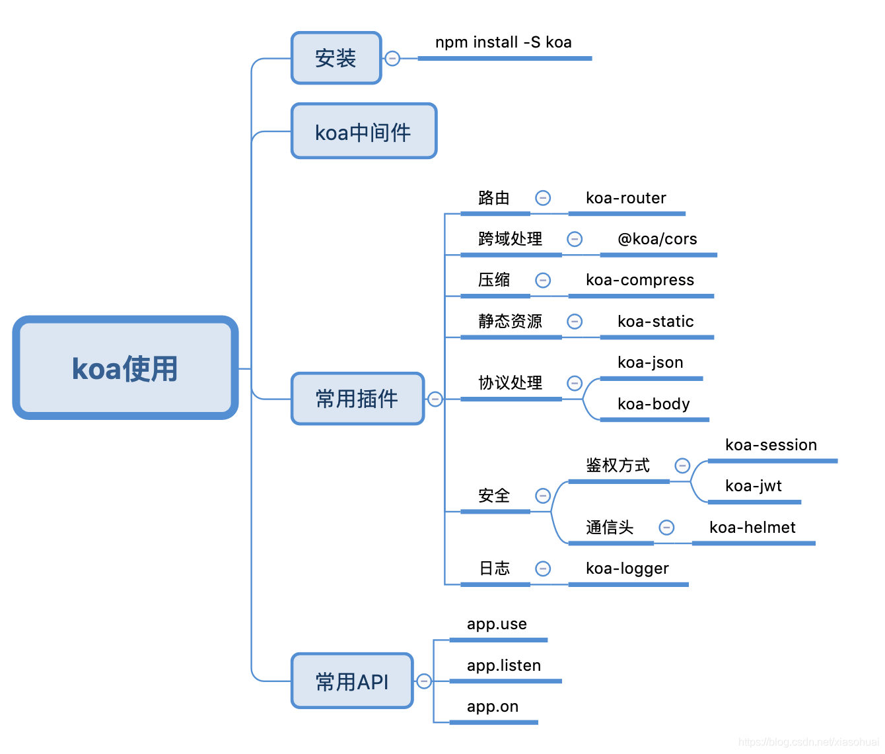

<!-- https://blog.csdn.net/xiasohuai/article/details/114483975 -->

## Koa介绍

Koa 是基于 Node.js 平台的下一代 web 开发框架。

Koa是由 Express 原班人马打造的，致力于成为一个更小、更富有表现力、更健壮的 Web 框架。 使用 Koa 编写 web 应用，可以免除重复繁琐的回调函数嵌套， 并极大地提升错误处理的效率。Koa不在内核方法中绑定任何中间件， 它仅仅提供了一个轻量优雅的函数库，使得编写 Web 应用变得得心应手，开发思路和 Express 差不多，最大的特点就是可以避免异步嵌套

## Koa的安装和基本使用


## koa的基本使用
```js
// 引入Koa
var koa = require('koa');
// 实例化Koa
var app = new koa();
 
app.use( async(ctx)=>{
    ctx.body = "hello,koa"
});
 
// 监听端口
app.listen(3000);
```
## koa路由的使用
```js
// 1.安装 npm install --save koa-router
 
var Koa = require('koa');
// 2.引入路由并实例化
var Router = require('koa-router');
var app = new Koa();
var router = new Router();
 
// 路由路径前缀设置
router.prefix('/api')
 
// 3.配置路由
router.get('/get', async (ctx) => { // 路径: /api/get
    // 返回数据给前端
    ctx.body = "返回响应数据";
});
 
// 4.启动路由(来自于官方文档);
// router.allowedMethods()可以配置也可以不配置。
// 如果之前的没有设置响应头，配置此选项以后可以自动设置响应头。
app.use(router.routes()).use(router.allowedMethods());
 
// 监听端口
app.listen(3000);
```
## Koa中间件

中间件是配合路由匹配完成做的一系列的操作，我们就可以把它叫做中间件。Koa中运用中间件可以实现以下一些功能：

1. `添加应用`。主要通过`app.use()`这个函数添加或是启动一些应用，如常见的一些第三方中间件的使用。
2. `匹配路由`。主要通过`next()`这个函数完成多级路由匹配。
3. `错误处理`。如果当前访问的路由一直向下匹配没有匹配到，可以通过中间件给出错误响应。

```js
var Koa = require('koa');
var Router = require('koa-router');
var app = new Koa();
var router = new Router();
// Koa 错误处理中间件
// 无论app.use放到路由前面还是后面
// 都是先执行app.use再去执行路由
app.use(async (ctx, next) => {
    console.log('这是一个中间件');       // 执行顺序1
    await next();
    if (ctx.status == 404) {           // 执行顺序3
        ctx.body = '这是一个404页面';
    } else {
        console.log(ctx.url);
    }
});
// 配置新闻页                            // 执行顺序2
router.get('/news', async (ctx, next) => {
    console.log('这是新闻路由');
    await next();
});
 
app.use(router.routes());
app.use(router.allowedMethods());
 
app.listen(3000);
```
## 使用koa-body和@koa/cors

- `koa-body` 处理request过来的请求里面的数据
- `@koa/cors` 处理一些跨域请求
  
安装： `npm install -S koa-body @koa/cors`

### Koa中post传值的获取
```js
var Koa = require('koa');
var Router = require('koa-router');
var cors = require('@koa/cors');
var koabody = require('koa-body');
 
var app = new Koa();
var router = new Router();
 
router.post('/post', async (ctx, next) => {
    let {body}=ctx.request;//获取前端给的值
    ctx.body={//把body里面前端给的内容再返回给前端
        ...body
    }
});
 
//app.use注意顺序
app.use(koaBody())//处理request过来的请求里面的数据
app.use(cors())//处理一些跨域请求
 
app.use(router.routes())
    .use(router.allowedMethods());
 
app.listen(3000);
```
### Koa中get传值及获取get传值

1. `键值对拼接传参`，接收参数主要通过`ctx.qruery`获取，需要注意的是在`ctx与ctx.request`里均可以获得一样的结果。
```js

var Koa = require('koa');
var router = require('koa-router')();
var app = new Koa();
// http://localhost:3000/details?id=1&name=jiangyx
router.get('/details',async(ctx)=>{
    // 从ctx中读取Get传值
    console.log(ctx.url);// /details?id=1&name=jiangyx
    console.log(ctx.query); // { id: '1', name: 'jiangyx' } // 获取的是对象，用的最多的方式
    console.log(ctx.querystring) // id=1&name=jiangyx // 获取的是字符串
 
    // 从ctx里的request里获取Get传值
    console.log(ctx.request.url); // /details?id=1&name=jiangyx
    console.log(ctx.request.query); // { id: '1', name: 'jiangyx' }
    console.log(ctx.request.querystring); // id=1&name=jiangyx
});
 
app.use(router.routes());
app.use(router.allowedMethods());
app.listen(3000);
```

2. `动态路由传参`，接收参数主要通过`ctx.params`获取。   
```js
var Koa = require('koa');
var router = require('koa-router')();
var app = new Koa();
 
// http://localhost:3000/details/1/jiangyx
router.get('/details/:id/:name', async (ctx) => {
    // 获取动态路由的传值
    console.log(ctx.params); // { id: '1' ,name:'jiangyx'}
});
 
app.use(router.routes());
app.use(router.allowedMethods());
app.listen(3000);
```
## koa-json：按照json格式数据的传输

安装：`npm install -S koa-json`

```js

。。。。。
var json = require('koa-json');
。。。。。
 
app.use(json({ pretty: false, param: 'pretty' }));
。。。。 
 
//案例： 
// http://localhost:3000/details?id=1&name=jiangyx
返回结果：{"foo":"bar"}
 
// 路径加pretty
// http://localhost:3000/details?id=1&name=jiangyx&pretty
返回结果：
{
  "foo": "bar"
}
```
## 合并路由(路由压缩)：koa-combine-routers
```js
// 安装：npm install koa-combine-routers
 
// app.js
const Koa = require('koa')
const router = require('./routes')
 
const app = new Koa()
 
app.use(router())
 
 
// routers.js
const Router = require('koa-router')
const combineRouters = require('koa-combine-routers')
 
const dogRouter = new Router()
const catRouter = new Router()
 
dogRouter.get('/dogs', async ctx => {
  ctx.body = 'ok'
})
 
catRouter.get('/cats', async ctx => {
  ctx.body = 'ok'
})
 
const router = combineRouters(
  dogRouter,
  catRouter
)
module.exports = router
```

## 加入安全头：koa-helmet
```js

// 安装：npm install koa-helmet -S
 
// 使用：
const Koa = require("koa");
const helmet = require("koa-helmet");
const app = new Koa();
 
app.use(helmet());
 
app.use((ctx) => {
  ctx.body = "Hello World"
});
app.listen(4000);

```

## 静态资源：koa-static
```js
安装：npm install -S koa-static
 
使用：
const serve = require('koa-static');
const Koa = require('koa');
const app = new Koa();
 
// $ GET /package.json
app.use(serve('.'));
 
// $ GET /hello.txt
app.use(serve('test/fixtures'));
 
// or use absolute paths
app.use(serve(__dirname + '/test/fixtures'));
 
app.listen(3000);
 
console.log('listening on port 3000')
```

## 上传图片
- 基础功能：图片上传、生成图片链接- 
- 附加功能：限制上传图片的大小与类型、生成高中低三种分辨率的图片链接、生成CDN

**安装**
```js
npm i koa-body
npm i koa-static
```
**app.js**
```js
const KoaBody = require("koa-body");
const serve = require("koa-static");

// 静态资源目录
app.use(serve(path.join(__dirname, "public")));
// 解析 body
app.use(
  KoaBody({
    multipart: true,
    formidable: {
      uploadDir: path.join(__dirname, "public/uploads"),
      keepExtensions: true,
    },
  })
);
```
**controllers/common.js**
```js
// Content-Type 为 multipart/form-data 才会被解析
upload(ctx) {
  const file = ctx.request.files.file;
  const basename = path.basename(file.path);
  ctx.body = {
    url: `${ctx.origin}/uploads/${basename}`,
  };
}
```
**public/index.html**
```html
<!DOCTYPE html>
<html lang="en">
  <head>
    <meta charset="UTF-8" />
      <meta name="viewport" content="width=device-width, initial-scale=1.0" />
    <title>Document</title>
  </head>
  <body>
    <form action="/upload" enctype="multipart/form-data" method="POST">
      <!-- 必须指定 name 否则后端获取不到文件 -->
      <input type="file" name="file" accept="image/*" />
<!-- accept可以指定允许上传的图片类型，比如image/gif, image/jpeg，多种类型用逗号隔开 -->
      <button type="submit">上传</button>
    </form>
  </body>
</html>
```

## 使用koa-compose集成中间件
```js
import koa from 'koa'
import path from 'path'
import helmet from 'koa-helmet'
import statics from 'koa-static'
import router from './routes/routes'//合并路由后的routers.js
import koaBody from 'koa-body'
import jsonutil from 'koa-json'
import cors from '@koa/cors'
import compose from 'koa-compose'
 
const app = new koa()
 
// app.use...
// app.use(helmet()) 
// app.use(statics(path.join(__dirname, '../public')))
// app.use(router())
const middleware = compose([
    koaBody(),
    statics(path.join(__dirname,'../public')),
    cors(),
    jsonutil({pretty: false, param:'pretty'}),
    helmet()
])
 
app.use(middleware)
app.use(router())
 
app.listen(3000);
```
## koa-compress压缩数据
```js
import koa from 'koa'
import path from 'path'
import helmet from 'koa-helmet'
import statics from 'koa-static'
import router from './routes/routes'//合并路由后的routers.js
import koaBody from 'koa-body'
import jsonutil from 'koa-json'
import cors from '@koa/cors'
import compose from 'koa-compose'
import compress from 'koa-compress'
 
 
const app = new koa()
 
const isDevMode=process.env.NODE_ENV==='production'?false:true
 
const middleware = compose([
    koaBody(),
    statics(path.join(__dirname,'../public')),
    cors(),
    jsonutil({pretty: false, param:'pretty'}),
    helmet()
])
 
if(!isDevMode){
    app.use(compress())
}
 
app.use(middleware)
app.use(router())
 
app.listen(3000);
```
## koa-json-error处理错误
```js
// 安装：npm i koa-json-error

// windows环境可能需要安装cross-env来配置环境变量

// 配置koa-json-error，让其在生产环境下不打印堆栈信息

const error = require("koa-json-error");
// 在生产环境不返回错误堆栈信息
app.use(
  error({
    postFormat: (error, { stack, ...rest }) =>
      process.env.NODE_ENV === "production" ? rest : { stack, ...rest },
  })
);

```

### koa-parameter校验参数
```js
// 1.安装 npm i koa-parameter 

1. 使用
// app.js
app.use(parameter(app));

// controllers/users.js
async create(ctx) {
  ctx.verifyParams({
    name: { type: "string", required: true },
    password: { type: "string", required: true },
  });
  const { name } = ctx.request.body;
  const repeatedUser = await User.findOne({ name });
  if (repeatedUser) {
    ctx.throw(409, "用户名已经占用");
  }
  const user = await new User(ctx.request.body).save();

  ctx.body = user;
}
```

## webpack配置node
```js
// 安装
npm i -D webpack webpack-cli
npm i -D clean-webpack-plugin webpack-node-externals @babel/core @babel/node @babel/preset-env babel-loader cross-env
```
- clean-webpack-plugin 清理 dist 文件夹
- webpack-node-externals 排除 node_modules
- babel 支持es6语法

**webpack.config.js**
```js
const path = require('path')
const nodeExternals = require('webpack-node-externals')
const { CleanWebpackPlugin } = require('clean-webpack-plugin')

const webpackconfig = {
  target: 'node',
  mode: 'development',
  entry: {
    server: path.join(__dirname, 'src/app.js')
  },
  output: {
    filename: '[name].bundle.js',
    path: path.join(__dirname, 'dist')
  },
  devtool: 'eval-source-map',
  module: {
    rules: [
      {
        test: /\.(js|jsx)$/,
        use: {
          loader: 'babel-loader'
        },
        exclude: [path.join(__dirname, 'node_modules')]
      }
    ]
  },
  externals: [nodeExternals()],
  plugins: [new CleanWebpackPlugin()],
  node: {
    console: true,
    global: true,
    process: true,
    Buffer: true,
    __filename: true,
    __dirname: true,
    setImmediate: true,
    path: true
  }
}

module.exports = webpackconfig
```
**.babelrc**
```js
{
  "presets": [
    [
      "@babel/preset-env",
      {
        "targets": {
          "node": "current"
        }
      }
    ]
  ]
}
```
**package.json**
```js
"scripts": {
  "serve": "nodemon --exec babel-node src/app.js"
},
```


## nodemon 自动监测文件的变化，当有变化时重新启动服务，来调试基于node.js的应用程序。
```js
// 1.安装
npm install nodemon -D(--save-dev)

// 2.使用
nodemon dist/app.js // 启动node服务
nodemon ./main.js localhost 3000 // 在本地3000端口启动node服务

// 3 package.json配置
// nodemon是利用common.js语法执行的进行监视的，我们如何支持es6的语法进行监视执行呢？
"start": "nodemon --exec babel-node src/main.ts",
{
  "scripts": {
    "start": "tsc && node dist/app.js",
    "server:dev": "nodemon dist/app.js",
    "start": "ts-node -r tsconfig-paths/register nodemon src/app.ts",
    "watch": "nodemon --watch 'src/**/*' -e ts,tsx --exec 'ts-node' ./src/app.ts"
  }
}
// 运行nodemon start server:dev

// 4 配置 nodemon：为了监测指定的文件，需要配置 nodemon.json
{
    "watch":["./src/**/*.*"]
}
// 配置 nodemon debug模式
{
  "scripts": {
    "server:dev": "DEBUG=* nodemon dist/app.js",
  }
}
```

## Koa操作MySQL数据库
```js

// 1.npm install --save mysql
 
// 2.引入模块
const mysql = require('mysql');
 
// 3.连接数据库
const connection = mysql.createConnection({
    host: '127.0.0.1',         // 数据库地址
    user: 'root',              // 用户名 
    password: '123456' ,       // 密码   
    database: 'my_data'        // 数据库名称   
})
 
// 4.执行sql语句操作数据库
connection.query('SELECT * FROM user',
     (error, results, fields) => {
        if (error) {
            console.log(error)
        };
        // 操作数据
 
        // 结束会话
        connection.release();
    }
);
```
注意，数据库会话操作执行完后，需要关闭掉，以免占用连接资源。

当有多个会话需要操作数据库时，为了避免每次会话都要重新连接，所以这时候就需要连接池管理会话。

```js
// 1.npm install --save mysql
 
// 2.引入模块
const mysql = require('mysql');
 
// 3.创建数据池
const pool = mysql.createPool({
    host: '127.0.0.1',         // 数据库地址
    user: 'root',              // 用户名 
    password: '123456',        // 密码   
    database: 'my_data'        // 数据库名称 
})
 
// 4.在数据池中进行会话操作
pool.getConnection(function (err, connection) {
    // 5.执行sql语句操作数据库
    connection.query('SELECT * FROM user', 
        (error, results, fields) => {
        
            // 执行操作
 
            // 释放连接
            connection.release();
            // 如果有错误就抛出
            if (error) {
                throw error;
            }
        }
    )
})
```

## 连接mongoose
```js
// app.js

const mongoose = require("mongoose");
const { connectionStr } = require("./config");

mongoose.connect(
  connectionStr,
  { useUnifiedTopology: true, useNewUrlParser: true },
  () => console.log("connect")
);
mongoose.connection.on("error", console.error);
```
### 定义Schema
```js
// models/User.js

const mongoose = require("mongoose");

const { Schema, model } = mongoose;
const userSchema = new Schema(
  {
    name: { type: String, required: true },
    // select 为 false 时查询时默认隐藏
    password: {
      type: String,
      required: true,
      select: false,
      set(val) {
        return require("bcrypt").hashSync(val, 10);
      },
    },
    avatar_url: { type: String },
    gender: {
      type: String,
      enum: ["male", "female"],
      default: "male",
      required: true,
    },
    headline: { type: String },
    locations: {
      type: [{ type: Schema.Types.ObjectId, ref: "Topic" }],
      select: false,
    },
    business: { type: Schema.Types.ObjectId, ref: "Topic", select: false },
    employments: {
      type: [
        {
          company: { type: Schema.Types.ObjectId, ref: "Topic" },
          job: { type: Schema.Types.ObjectId, ref: "Topic" },
        },
      ],
      select: false,
    },
    educations: {
      type: [
        {
          school: { type: Schema.Types.ObjectId, ref: "Topic" },
          major: { type: Schema.Types.ObjectId, ref: "Topic" },
          diploma: {
            type: Number,
            enum: [1, 2, 3, 4, 5],
          },
          entrance_year: { type: Number },
          graduation_year: { type: Number },
        },
      ],
      select: false,
    },
    following: {
      type: [
        {
          type: Schema.Types.ObjectId,
          ref: "User",
        },
      ],
      select: false,
    },
    // 关注话题
    followingTopics: {
      type: [{ type: Schema.Types.ObjectId, ref: "Topic" }],
      select: false,
    },
    // 关注问题
    followingQuestions: {
      type: [{ type: Schema.Types.ObjectId, ref: "Question" }],
      select: false,
    },

    likingAnswers: {
      type: [
        {
          type: Schema.Types.ObjectId,
          ref: "Answer",
        },
      ],
      select: false,
    },
    dislikingAnswers: {
      type: [
        {
          type: Schema.Types.ObjectId,
          ref: "Answer",
        },
      ],
      select: false,
    },
    collectingAnswers: {
      type: [
        {
          type: Schema.Types.ObjectId,
          ref: "Answer",
        },
      ],
      select: false,
    },
  },
  {
    timestamps: true,
  }
);

module.exports = model("User", userSchema);
```
### 字段过滤
让一些字段默认不显示，方法是修改schema，在默认不显示的字段上添加`select:false`。在查询时如果需要这个字段，需要加上`select("+fieldName")`

### 权限认证
```js
// controllers/users.js

const jwt = require("jsonwebtoken");
const User = require("../models/User");
const { secret } = require("../config");
const bcrypt = require("bcrypt");
class UsersCtl {

  // 登录
  async login(ctx) {
    const { name, password } = ctx.request.body;
    const user = await User.findOne({ name }).select("+password");
    if (!user) {
      ctx.throw(422, "用户不存在");
    }
    const isValid = bcrypt.compareSync(password, user.password);
    if (!isValid) {
      ctx.throw(422, "用户密码错误");
    }

    const token = jwt.sign({ _id: user._id, name }, secret, {
      expiresIn: "1d",
    });
    ctx.body = { token };
  }

  // 检查权限，只允许修改本人信息
  async checkOwner(ctx, next) {
    if (ctx.params.id !== ctx.state.user._id) {
      ctx.throw(403, "没有权限");
    }
    await next();
  }
}
module.exports = new UsersCtl();
```
```js
// routes/users.js

const Router = require("koa-router");
const router = new Router({ prefix: "/users" });
const jwt = require("jsonwebtoken");
const { secret } = require("../config");
const {
  find,
  findById,
  create,
  update,
  del,
  login,
  checkOwner,
} = require("../controllers/users");

const auth = async (ctx, next) => {
  const { authorization = "" } = ctx.request.header;
  const token = authorization.replace("Bearer ", "");
  try {
    const user = jwt.verify(token, secret);
    ctx.state.user = user;
  } catch (error) {
    ctx.throw(401, error.message);
  }
  await next();
};

router.get("/", find);
router.get("/:id", findById);
router.post("/", create);
router.patch("/:id", auth, checkOwner, update);
router.delete("/:id", auth, checkOwner, del);
router.post("/login", login);

module.exports = router;
```
### koa-jwt实现权限认证
```js
// 1. 安装 npm i koa-jwt

// 2.使用
const Router = require("koa-router");
const router = new Router({ prefix: "/users" });
// const jwt = require("jsonwebtoken");
const jwt = require("koa-jwt");
const { secret } = require("../config");
const {
  find,
  findById,
  create,
  update,
  del,
  login,
  checkOwner,
} = require("../controllers/users");

const auth = jwt({ secret });

// 获取用户列表
router.get("/", find);
// 获取用户详情
router.get("/:id", findById);
// 创建用户
router.post("/", create);
// 更新用户 patch 可以更新部分
router.patch("/", auth, update);
// 删除用户
router.delete("/", auth, del);
// 登录
router.post("/login", login);

module.exports = router;
```

## 分页和模糊搜索
```js
// 分页搜索的关键是`skip`和`limit`这两个查询参数，模糊搜索则使用了正则表达式

async find(ctx) {
  const { per_page = 10 } = ctx.query;
  const page = Math.max(ctx.query.page * 1, 1) - 1;
  const perPage = Math.max(per_page * 1, 1);
  const q = new RegExp(ctx.query.q);
  ctx.body = await Question.find({ $or: [{ title: q }, { description: q }] })
    .limit(perPage)
    .skip(perPage * page);
}
```

## 断点调试

- `nodejs在Chrome` 中断点调试：[https://blog.csdn.net/xiasohuai/article/details/90551504](https://blog.csdn.net/xiasohuai/article/details/90551504)

- `nodejs在vscode` 中断点调试：[https://blog.csdn.net/xiasohuai/article/details/90551380](https://blog.csdn.net/xiasohuai/article/details/90551380)
  ```js
  // 1. 在`configurations`中输入`nodemon`，选择nodemon setup快速生成配置样板
  // 2. .vscode/launch.json
  {
    // Use IntelliSense to learn about possible attributes.
    // Hover to view descriptions of existing attributes.
    // For more information, visit: https://go.microsoft.com/fwlink/?linkid=830387
    "version": "0.2.0",
    "configurations": [
      {
        "console": "integratedTerminal",
        "internalConsoleOptions": "neverOpen",
        "name": "nodemon",
        "program": "${workspaceFolder}/src/app.js",
        "request": "launch",
        "restart": true,
        "runtimeExecutable": "nodemon",
        "skipFiles": ["<node_internals>/**"],
        "type": "pwa-node",
        "runtimeArgs": ["--exec", "babel-node"]
      }
    ]
  }
  // program指定入口文件，指定runtimeArgs是因为使用了es6语法
  ```
- `webpack打包过程如何调试（浏览器）`：[https://blog.csdn.net/xiasohuai/article/details/107889879](https://blog.csdn.net/xiasohuai/article/details/107889879)
  ```js
  // 1. 运行 `node --inspect-brk ./node_modules/.bin/webpack --inline --progress`
  // 2. 浏览器访问`chrome://inspect/#devices`，点击inspect进入调试页面
  // 3. 为了调试方便，可以在package.json文件中加入如下命令
  "scripts": {
    "webpack:debug": "node --inspect-brk ./node_modules/.bin/webpack --inline --progress"
  },
  // 4. 之后调试webpack只需要运行npm run webpack:debug
  ```


  

